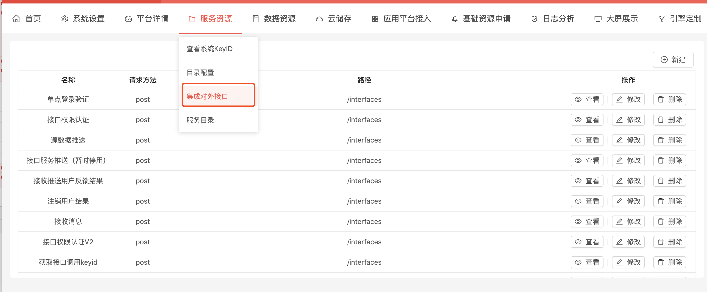
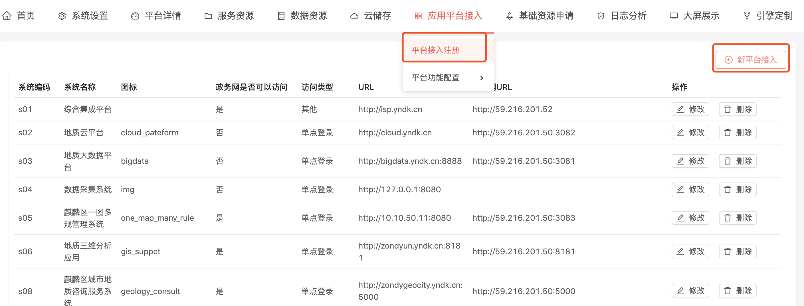
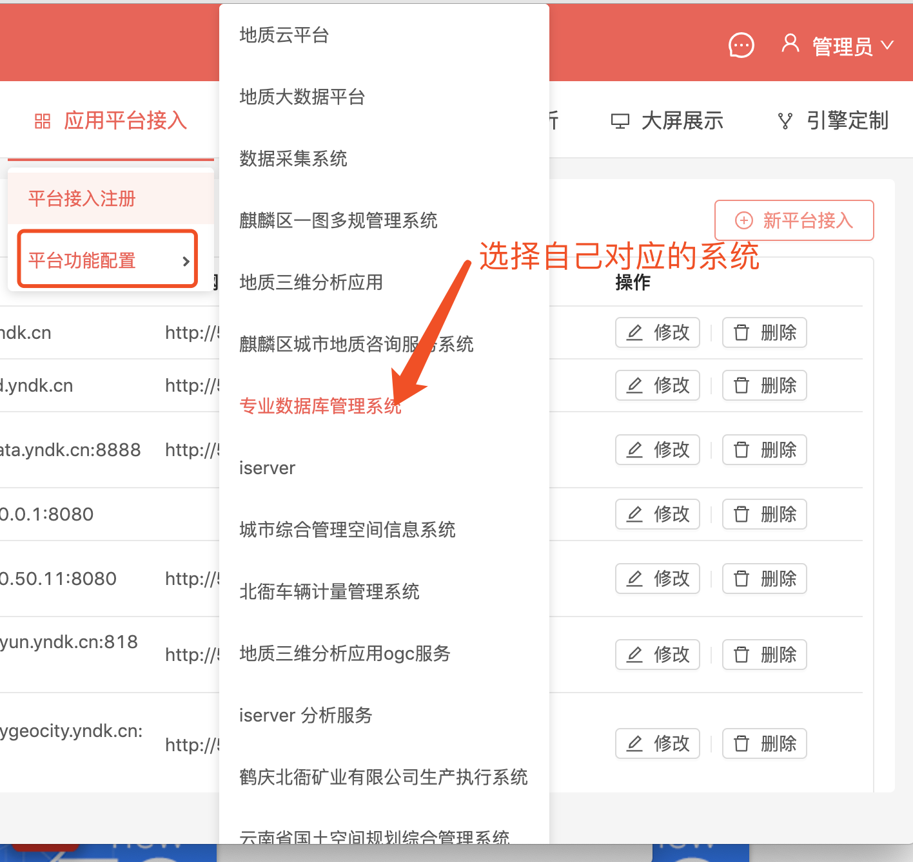
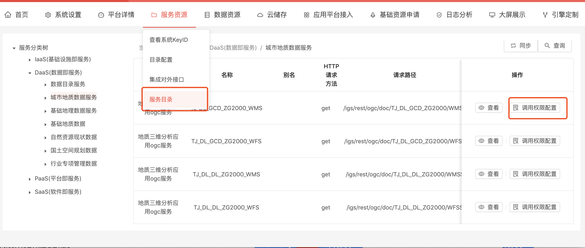

# 约定
为方便说明,以下统一将综合集成系统称为**集成**,将接入集成的系统称成为**应用系统**

# 集成对外接口说明
**集成**所有的对外接口可以在如下页面找到,页面中有接口调用的详细信息


# 综合集成接入流程
先在集成页面上新建一个系统(图1)

新建系统时需填以下字段:
>|字段名称|说明        |
>|:-----|:-----|
>|平台编码 |以s开头的编码,可随意填写但不能和已有系统重复 |
>|政务网是否可以访问该系统 | 该系统是否需要映射到政务外网,如果是需要填写政务网URL |
>|访问类型 | 需要接入集成的系统需选择单点登录 |
>|URL|系统的访问地址 |
>|政务网URL |系统映射到政务外网的地址 |

新建系统完成后需要在对应的页面完成系统功能配置(图2)


在系统功能配置页面需要配置接入集成所需的接口地址,集成需要**应用系统**提供如下几个接口:
>||
>|:--|
>|登录|
>|退出|
>|推送用户信息|
>|注销平台用户|
>|服务资源目录|
>|系统元数据|

配置时填入接口的相对路径,列如某个接口配置的路径为 "/path",那么将根据第一步配置的URL+'/path'来调用该接口
以下对各个接口进行说明

## 登录
这个接口用于单点登录,由集成页面跳转到**应用系统**时将会以get请求方式调用该接口,并在调用URL后面上一个验证字符串,
整个调用URL为形如以下形式:
```
http://cloud.yndk.cn/api/auth/isp/login?ispToken=4QJkn6Eh
```
**应用系统**应该在取到ispToken后调用集成的**单点登录验证**接口进行验证(有关**单点登录验证**的信息请参见**集成对外接口说明**)
如果**单点登录验证**返回成功,则应该保存当前用户信息(用户信息在**单点登录验证**接口中返回),并进入到系统成功登录的页面,不成功则重定向到集成首页

## 退出
在集成页面点击退出按钮时,集成会向单点登录过的**应用系统**调用退出接口,告知**应用系统**该用户退出
调用URL形如以下形式
```
http://cloud.yndk.cn/api/auth/isp/logout?username=admin
```
其中admin为当前退出的用户名,**应用系统**应该清除用户的登录状态,使得用户在退出后刷新页面时页面重定向到集成登录页:http://isp.yndk.cn


## 推送用户信息
**集成**是所有用户的入口,所有用户由集成注册生成并统一管理,理论上**应用系统**不应该自己生成用户,当某个用户需要访问某个**应用系统**,需要发起系统访问权限申请流程,当流程通过时,**集成**会以post形式调用该接口,将用户信息推送给**应用系统**,**应用系统**应在此创建用户,在完成用户创建后调用**集成**的**接收推送用户反馈结果**接口,将是用户是否创建成功的信息告知**集成**,如果**集成**收到用户创建成功的消息,那么该用户的首页上将会出现**应用系统**的跳转连接,用户可以通过点击该连接单点登录到**应用系统**;
**集成**调用**应用系统**推送用户信息时会在post请求体中传递如下信息:
```
{
      username:'admin',//用户名,全局唯一
      name: '管理员',   //用户中文名
      phone: '123',
      email: '123@gmail.com',
}
```

## 注销平台用户
和**推送用户信息**完全相同的形式,以同样的请求体进行post调用,**集成**在调用**应用系统**的该接口后,**应用系统**应该删除该用户,并在删除完成后调用集成的**注销用户结果**接口


## 服务资源目录
**集成**以get请求向**应用系统**获取该**应用系统**对外发布的接口信息,**应用系统**应以如下的JSON格式返回:
```
[
    {
        "name":"xxx服务",//服务名称   
        "alias":"xx别名",//服务别名（有就填）
    
        "path":"/text",  //请求路径(除去平台URL后面的部分)
        "image_path":"http://127.0.0.1/path/image",//缩略图（地图服务必须）
    
        "method":"get",//http方法
    
        "service_tree_id":1,//服务所属节点(在服务类型树上所在的节点ID)
    
        "head":"{Accept:application/json}", //请求头示列(以字符串形式传递即可)
   
        "body":"{a:1}", //请求体示列(以字符串形式传递即可)

        "result":"{b:1}",//返回结果示列(以字符串形式传递即可)
    
        "info":"接口说明及描述" //描述信息,可以不填
    
}
]
```

# 接口调用权限认证
通过**服务资源目录**取到的接口信息会展示在集成服务目录页面:

在页面上可以查看接口的详细的调用信息并配置调用权限
现假设**A系统**需要调用**B系统**的接口**interface**,那么需要在页面上对**interface**接口进行权限配置,将调用权限赋予A系统;
**A系统**在调用接口前,应先通过集成的**获取接口调用keyid**接口,获取自己的keyid,然后将keyid放入请求头中调用**interface**,
**B系统**应该有统一的拦截器拦截所有的对外接口请求,在拦截器中,**B系统**得到**A系统**传过来的keyid,调用集成的**接口权限认证V2**接口进行认证,如果**接口权限认证V2**返回成功,则**B系统**应该让**A系统**完成**interface**的调用,否则则应该返回没有调用权限


